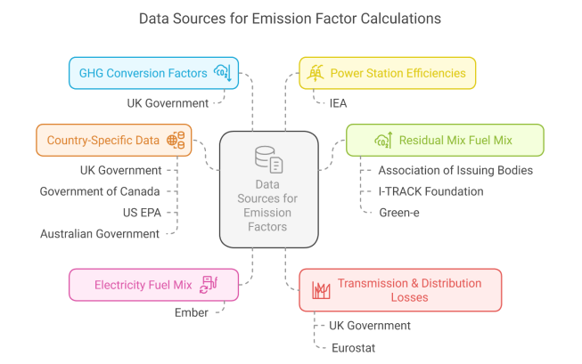

# Electricity Grid Emissions Data

This document describes the emissions data used by the LLM Behaviour Lab to calculate the carbon footprint of LLM inference based on electricity consumption.

## Overview

When the lab calculates energy consumption (in Watt-hours), it converts this to a carbon footprint estimate (in grams of CO2 equivalent) by multiplying by an **emission factor**. The emission factor represents how much CO2 is released per unit of electricity generated, which varies significantly depending on the electricity generation mix (fuel sources) of each country or region.

## What is an Emission Factor?

An **emission factor** (also called a grid carbon intensity factor) expresses the amount of greenhouse gas emissions associated with generating one kilowatt-hour (kWh) of electricity. It is typically measured in:

- **kgCO2e/kWh** (kilograms of CO2 equivalent per kilowatt-hour)
- **gCO2/kWh** (grams of CO2 per kilowatt-hour)

The emission factor depends on the electricity generation fuel mix of a region:
- Countries with high renewable energy (hydro, solar, wind, nuclear) have **low** emission factors
- Countries reliant on fossil fuels (coal, natural gas, oil) have **high** emission factors

For example:
- **France** (nuclear-heavy): ~0.047 kgCO2e/kWh
- **Norway** (hydro-heavy): nearly 0 kgCO2e/kWh  
- **India** (coal-heavy): ~0.95 kgCO2e/kWh
- **Global Average**: 0.445 kgCO2e/kWh

## Data Location

The emissions data is stored in:

```
data/emissions.json
```

This JSON file contains emission factors for 209 countries/regions, plus a global average entry. Each entry includes:

- `country_name`: Human-readable country name
- `country_code`: ISO 2-letter country code (or "GLOBAL" for global average)
- `emission_factor`: kgCO2e/kWh (kilograms of CO2 equivalent per kilowatt-hour)
- `year`: Year of the data (typically 2025)
- `source` (optional): Data source attribution

### Formula

The carbon footprint calculation is:

```
Carbon (gCO2) = Energy (Wh) × Emission Factor (kgCO2e/kWh)
```

Where:
- Energy is in Watt-hours (Wh)
- Emission factor is in kilograms of CO2 equivalent per kilowatt-hour
- Result is in grams of CO2 equivalent

## Data Sources

### Global Average (Default)

The default global average emission factor of **445 g CO2/kWh (0.445 kgCO2e/kWh)** comes from:

> **IEA (2025)** *Electricity 2025 - Emissions*  
> Available at: [https://www.iea.org/reports/electricity-2025/emissions](https://www.iea.org/reports/electricity-2025/emissions)

This represents the worldwide average carbon intensity of electricity generation.

### Country-Specific Data

Country-specific emission factors are sourced from:

> **CaDI (2024)** *Greenhouse Gas Emissions Factors for International Grid Electricity* (calculated from fuel mix)  
> Available at: [www.carbondi.com](https://www.carbondi.com)

CaDI (Carbon Data Intelligence) provides comprehensive, up-to-date emission factors for countries worldwide, calculated from actual electricity generation fuel mix data.

## Methodology

The methodology underpinning the emission factor calculations follows established practices from the carbon footprinting industry. A comprehensive overview of the data sources and calculation approach is provided by Carbon Footprint Ltd:

> **Carbon Footprint Ltd (2025)** *Electricity GHG Factors Methodology 2025*  
> Available at: [https://www.carbonfootprint.com/docs/2025_6_electricity_ghg_factors_methodology_2025_10.pdf](https://www.carbonfootprint.com/docs/2025_6_electricity_ghg_factors_methodology_2025_10.pdf)

### Data Sources for Emission Factor Calculations

The following diagram illustrates the various data sources that feed into the calculation of emission factors:



Key data sources include:

- **GHG Conversion Factors**: UK Government
- **Power Station Efficiencies**: IEA (International Energy Agency)
- **Country-Specific Data**: UK Government, Government of Canada, US EPA, Australian Government
- **Electricity Fuel Mix**: Ember
- **Residual Mix Fuel Mix**: Association of Issuing Bodies, I-TRACK Foundation, Green-e
- **Transmission & Distribution Losses**: UK Government, Eurostat

These data sources are combined to calculate location-based and market-based emission factors that account for:

1. The fuel mix of electricity generation (coal, gas, nuclear, renewables, etc.)
2. The efficiency of power stations
3. Transmission and distribution losses
4. Country or region-specific factors

## Usage in the Lab

In the Energy Testing Lab UI:

1. The **Results Overview** card includes an "Electricity Grid" dropdown
2. By default, "Global Average" is selected (0.445 kgCO2e/kWh)
3. Users can select their country to get location-specific carbon footprint estimates
4. The carbon calculation updates automatically when the grid selection changes

This allows users to understand the real-world environmental impact of their LLM usage based on where the inference is actually performed, rather than relying on a global average that may not reflect local conditions.

## Updating the Data

To update the emissions data:

1. Edit `data/emissions.json` directly, or
2. Use the `fetch_emissions.py` script to fetch updated data from CaDI (requires active session credentials)

The global average should be updated annually based on the latest IEA reports.
